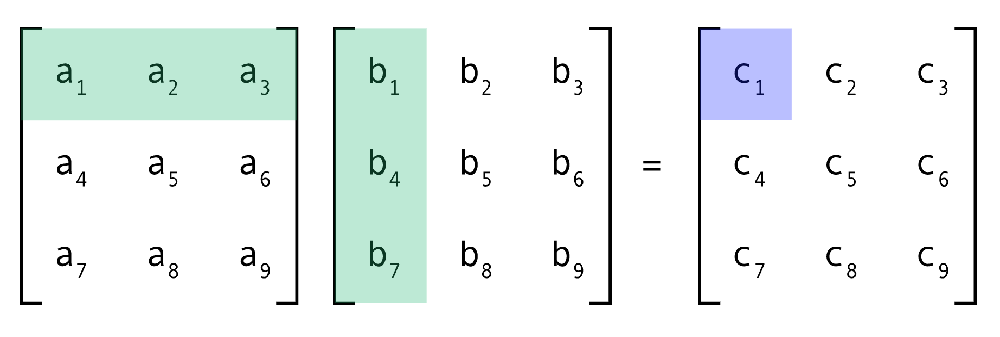

# Matrix Multiplication (Multi-Threading)

## Target

* To get familiar with thread programming using the [Pthread library](https://hpc-tutorials.llnl.gov/posix/).
* To better understand processes and threads.
The input to the program is two matrixes A(x*y) and B(y*z) that are read from corresponding text files. The output is a matrix C(x*z) that is written to an output text file.

A parallelized version of matrix multiplication can be done using one of these three methods:

1. A thread computes the output C matrix i.e. without multi-threading. (A thread per matrix).

2. A thread computes each row in the output C matrix. (A thread per row).

3. A thread computes each element in the output C matrix. (A thread per element).

## Readings & Resources

* [Stack vs Heap Memory.](https://dotnettutorials.net/lesson/stack-vs-heap-memory/)
* [C Dynamic Memory Allocation.](https://www.programiz.com/c-programming/c-dynamic-memory-allocation)
